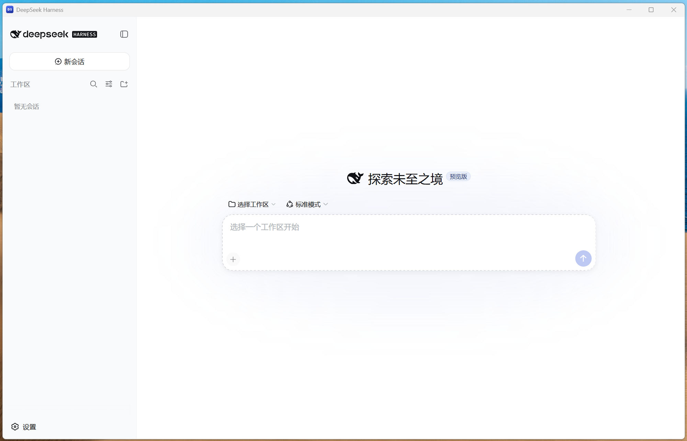

# DSH Desktop 桌面版

**简体中文** | [English](README.en.md)

> 本项目基于 DeepSeek AI 开源的 [DeepSeek Harness](https://github.com/deepseek-ai/deepseek-harness)（MIT）封装而成，由社区开发维护，让 Harness 拥有双击即用的桌面体验。各组件的许可归属详见[许可与致谢](#许可与致谢)。

DeepSeek Harness 的桌面应用：**双击一个图标，在独立窗口里使用完整的 Web 界面。** 不需要浏览器、不需要终端、不需要预装 Node.js。



## 下载与安装

从 [Releases 发布页](../../releases) 下载 `dsh-desktop-v1.1.0-win-x64.zip`（**138 MB**），解压到任意文件夹，双击 `DSH桌面版.exe`。

首次运行会出现安装向导，自动完成环境准备（仅一次）：

```
① 环境检查 ─ 系统已装 Node.js ≥ 22.15？→ 直接复用，跳到 ③
② 运行时   ─ 没有？自动从地区镜像下载 Node.js（34 MB）
③ 组件安装 ─ 通过 npm 安装 dsh 及约 530 个依赖包
④ 启动     ─ 主界面打开
```

下载源根据时区自动判定：中国时区走 npmmirror 镜像，其他地区走国际官方源；向导中可手动切换，失败可一键重试，全程进度条可视化。

### 体积说明

| 项目 | 大小 |
|---|---|
| 下载的压缩包 | 138 MB |
| 解压后 | 348 MB（Electron 壳及应用） |
| 首次运行自动获取 | Node.js 约 34 MB（压缩包）+ dsh 依赖约 330 MB |
| 全部就绪后总占用 | 约 780 MB |
| 之后每次启动 | 约 2 秒，不再联网下载 |

### 常见问题

| 问题 | 答案 |
|---|---|
| 会改动我的系统环境吗？ | 不会。所有组件都在应用文件夹内；借用系统 Node 时只执行、不修改；不写注册表、不改环境变量。删除文件夹即完全卸载。 |
| 我的聊天记录存在哪？ | `C:\Users\<用户名>\.dsh`，与命令行版（`npx @deepseek-ai/dsh web`）共用。 |
| 每次启动都要检查/下载吗？ | 不用，只有缺组件才触发，之后启动直达界面（约 2 秒）。 |
| 能搬走文件夹或重装系统吗？ | 文件夹整体移动没问题（重建桌面快捷方式即可）；聊天记录在文件夹外，不受影响。 |
| 能同时开两个窗口吗？ | 不能，再次双击会聚焦到已打开的窗口。 |
| 用什么端口？ | 每次启动自动选用空闲端口，零配置、不冲突。 |
| 杀毒软件报警？ | 应用完全本地运行、无遥测，改名的 Electron 程序偶发启发式误报。 |

### 升级新版本

下载新的 release 压缩包，解压后替换旧文件夹即可。首次运行会自动检查，只下载有变化的部分。

## 开发者

### 从源码构建

环境要求：git、Node.js ≥ 22.15、npm（Windows 下使用 Git Bash）。

```bash
git clone https://github.com/zouzhe1/dsh-desktop.git
cd dsh-desktop
tools/build.sh        # 组装 dist/dsh-desktop/（约 348 MB）
```

构建默认从 npmmirror 镜像下载 Electron 与 Node.js，可用环境变量 `ELECTRON_MIRROR`、`NODE_MIRROR`、`NODE_VERSION` 覆盖。如需完全离线的全内置版本，运行 `tools/build.sh full`（约 760 MB，自带 Node 运行时与全部依赖）。

### 跟进上游 dsh 新版本

```bash
tools/update-dsh.sh   # 检查 npm 最新版 → 确认 → 升级 → 同步
```

dsh 目前处于 `0.1.0-rc` 阶段，候选版本可能包含破坏性变更，升级后建议先试用。

### 工作原理

```
DSH桌面版.exe (Electron)
 ├─ 首次运行：向导检查环境，补齐运行时与依赖
 ├─ 启动 server\node.exe → dsh web --port 0（随机空闲端口）
 └─ 窗口加载 http://127.0.0.1:<端口>
```

未修改 harness 的任何代码：`/api` 信任防线接受的正是窗口的 `127.0.0.1:<端口>` 来源，与浏览器标签页一致。

### 仓库结构

```
app/       Electron 主进程 + 预加载脚本 + 图标
electron/  Electron 官方发行包暂存
server/    dsh 依赖声明 + 运行时下载目标
tools/     build.sh · update-dsh.sh · 图标与快捷方式脚本
docs/      发布说明、上游 Discussions 草稿
```

## 许可与致谢

| 组成部分 | 许可证 | 归属 |
|---|---|---|
| 本仓库（Electron 壳、构建/升级脚本、文档） | MIT © 2026 zouzhe1 | 本项目 |
| [@deepseek-ai/dsh](https://github.com/deepseek-ai/deepseek-harness)（作为依赖打包） | MIT © DeepSeek AI | DeepSeek AI |
| [Electron](https://www.electronjs.org)（发行包） | MIT | OpenJS Foundation 及贡献者 |
| [Node.js](https://nodejs.org)（运行时） | MIT | OpenJS Foundation |

本仓库的 MIT 许可证只覆盖我们自己编写的代码（外壳与脚本）；打包在内的各组件归各自权利人所有，按其自身许可分发。
